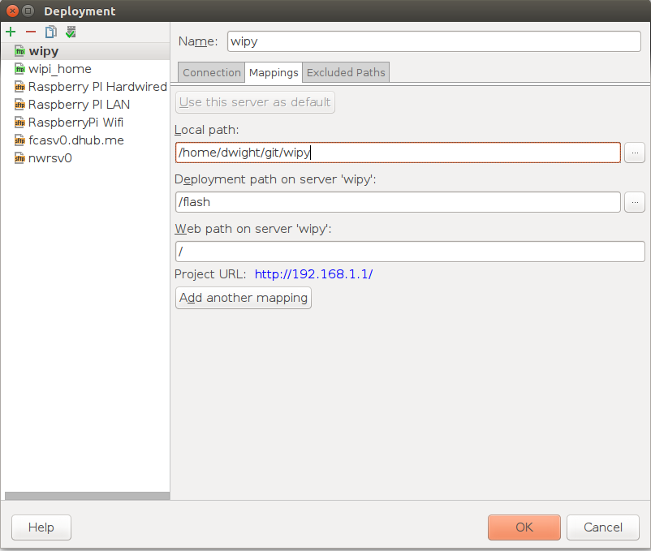

PyCharm Configuration for the WiPy
==================================

Although the PyCharm IDE does not have built in support for MicroPython or the WiPy board.  It is possible to
configure it to work well with the WiPy board.

PyCharm Automated Deployment to WiPy
------------------------------------

Since the WiPy board allows accessing the flash directories for the WiPy via FTP it is possible to configure pycharm
to automatically deploy the project's python code to the wipy every time we save it.

PyCharm Python Console on the WiPy
----------------------------------

It is possible to configure the python console in pycharm to use `wipy_tools` to provide the wipy console as the
python interprter in the "Python Console" window of pycharm.

* In the PyCharm Project Settings window select: Build, Execution, Deployment -> Console -> Python Console
* Select a Python interpreter or virtualenv that have the `wipy_tools` installed.
* For the startup script enter::

   from wipy_cli import console;console()

The resulting settings window should look like the following

